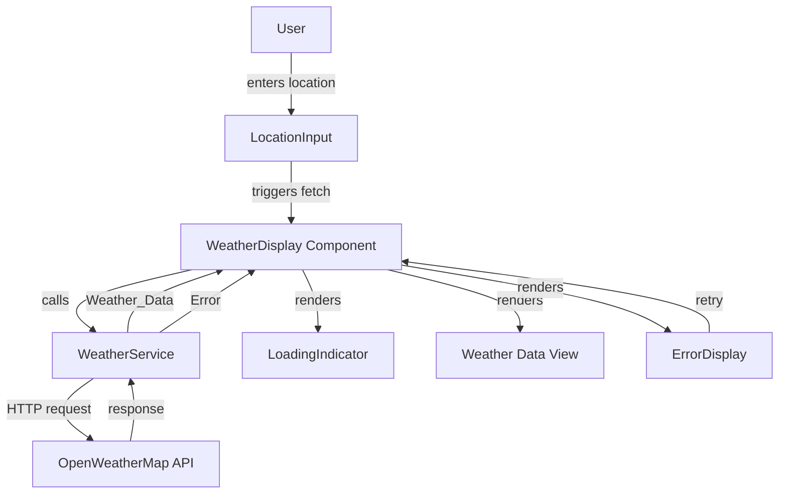
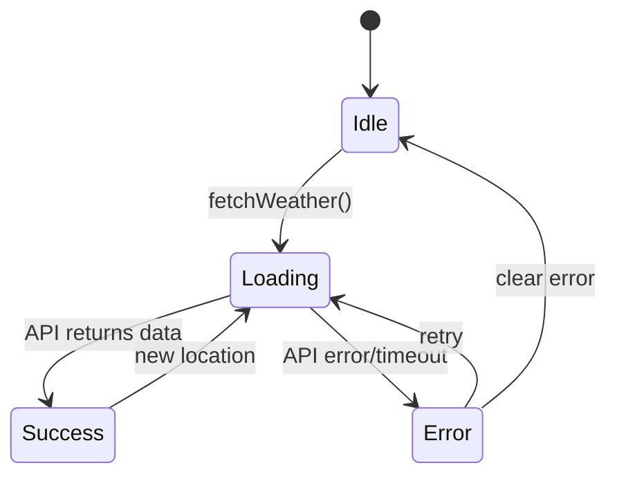

# Design Document: Weather API Integration

## Overview

This feature implements a weather data retrieval system using the OpenWeatherMap API. The system consists of a React-based UI component that displays weather information and a service layer that handles API communication. The design emphasizes clear separation between data fetching logic and presentation, with comprehensive state management for loading, success, and error conditions.

The implementation uses JavaScript with React for the frontend, leveraging React hooks for state management and the Fetch API for HTTP requests. The system is designed to be resilient, handling network failures, timeouts, and invalid inputs gracefully while providing clear feedback to users throughout the data retrieval process.

## Architecture

The system follows a layered architecture with three primary layers:

### Service Layer
- **WeatherService**: Encapsulates all API communication logic
- Handles HTTP requests to OpenWeatherMap API
- Manages authentication via API key
- Implements timeout logic (10 seconds)
- Transforms API responses into application-specific data structures
- Provides error handling and error object creation

### State Management Layer
- Uses React hooks (useState, useEffect) for component state
- Manages three primary states: loading, data, and error
- Coordinates state transitions based on API responses
- Ensures mutually exclusive states (loading XOR data XOR error)

### Presentation Layer
- **WeatherDisplay**: React component for rendering weather data
- **LoadingIndicator**: Visual feedback during data fetching
- **ErrorDisplay**: Error message presentation with retry capability
- **LocationInput**: User interface for location entry



## Components and Interfaces

### WeatherService

**Purpose**: Manages all interactions with the OpenWeatherMap API

**Interface**:
```javascript
class WeatherService {
  /**
   * Fetches weather data for a given location
   * @param {string} location - City name or coordinates
   * @returns {Promise<WeatherData>} Weather data object
   * @throws {WeatherError} On API errors, timeouts, or network failures
   */
  async fetchWeather(location)
  
  /**
   * Validates API key configuration
   * @returns {boolean} True if API key is configured
   */
  isConfigured()
}
```

**Implementation Details**:
- Uses Fetch API with AbortController for timeout implementation
- API endpoint: `https://api.openweathermap.org/data/2.5/weather`
- Includes API key in query parameters
- Timeout set to 10 seconds
- Parses JSON responses and validates structure
- Maps HTTP status codes to specific error types

### WeatherData Type

**Purpose**: Standardized data structure for weather information

```javascript
/**
 * @typedef {Object} WeatherData
 * @property {string} location - City name and country code
 * @property {number} temperature - Temperature in Celsius
 * @property {string} conditions - Weather condition description
 * @property {string} icon - Weather icon code
 * @property {number} humidity - Humidity percentage
 * @property {number} windSpeed - Wind speed in m/s
 * @property {number} timestamp - Unix timestamp of data
 */
```

### WeatherError Type

**Purpose**: Structured error information for error handling

```javascript
/**
 * @typedef {Object} WeatherError
 * @property {string} type - Error type: 'timeout' | 'network' | 'api' | 'not_found'
 * @property {string} message - User-friendly error message
 * @property {number} [statusCode] - HTTP status code if applicable
 * @property {*} [originalError] - Original error object for debugging
 */
```

### WeatherDisplay Component

**Purpose**: Main React component orchestrating weather data display

**Props**:
```javascript
/**
 * @typedef {Object} WeatherDisplayProps
 * @property {string} [initialLocation] - Optional initial location to fetch
 * @property {Function} [onLocationChange] - Callback when location changes
 */
```

**State**:
```javascript
{
  location: string,           // Current location query
  weatherData: WeatherData | null,
  isLoading: boolean,
  error: WeatherError | null
}
```

**Hooks**:
- `useState` for managing component state
- `useEffect` for triggering API calls on location changes
- `useCallback` for memoizing event handlers

### LoadingIndicator Component

**Purpose**: Visual feedback during API requests

**Props**:
```javascript
/**
 * @typedef {Object} LoadingIndicatorProps
 * @property {string} [message] - Optional loading message
 */
```

### ErrorDisplay Component

**Purpose**: Error message presentation with retry functionality

**Props**:
```javascript
/**
 * @typedef {Object} ErrorDisplayProps
 * @property {WeatherError} error - Error object to display
 * @property {Function} onRetry - Callback function for retry action
 */
```

## Data Models

### API Request Flow

1. **Request Initiation**:
   - User provides location via LocationInput
   - WeatherDisplay updates state: `isLoading = true, error = null`
   - WeatherService.fetchWeather() is called

2. **Request Construction**:
   ```javascript
   const url = new URL('https://api.openweathermap.org/data/2.5/weather');
   url.searchParams.append('q', location);
   url.searchParams.append('appid', API_KEY);
   url.searchParams.append('units', 'metric');
   ```

3. **Timeout Handling**:
   ```javascript
   const controller = new AbortController();
   const timeoutId = setTimeout(() => controller.abort(), 10000);
   ```

4. **Response Processing**:
   - Success (200): Parse JSON → Transform to WeatherData → Return
   - Not Found (404): Create WeatherError with type 'not_found'
   - Other errors: Create WeatherError with type 'api'
   - Timeout: Create WeatherError with type 'timeout'
   - Network failure: Create WeatherError with type 'network'

### State Transitions



### OpenWeatherMap API Response Structure

**Successful Response**:
```json
{
  "coord": { "lon": -0.1257, "lat": 51.5085 },
  "weather": [
    {
      "id": 800,
      "main": "Clear",
      "description": "clear sky",
      "icon": "01d"
    }
  ],
  "main": {
    "temp": 15.5,
    "feels_like": 14.8,
    "humidity": 72
  },
  "wind": {
    "speed": 3.5
  },
  "name": "London",
  "sys": {
    "country": "GB"
  },
  "dt": 1699876543
}
```

**Transformation to WeatherData**:
```javascript
{
  location: `${response.name}, ${response.sys.country}`,
  temperature: response.main.temp,
  conditions: response.weather[0].description,
  icon: response.weather[0].icon,
  humidity: response.main.humidity,
  windSpeed: response.wind.speed,
  timestamp: response.dt
}
```


## Correctness Properties

*A property is a characteristic or behavior that should hold true across all valid executions of a system—essentially, a formal statement about what the system should do. Properties serve as the bridge between human-readable specifications and machine-verifiable correctness guarantees.*

### Property 1: API Request Construction

*For any* valid location string, when fetchWeather() is called, the service should construct an HTTP request to the OpenWeatherMap endpoint with the location as a query parameter and include the API key.

**Validates: Requirements 1.1, 1.3**

### Property 2: Response Parsing Completeness

*For any* valid OpenWeatherMap API response, parsing should produce a WeatherData object containing all required fields (location, temperature, conditions, icon, humidity, windSpeed, timestamp) with values matching the source response.

**Validates: Requirements 1.2**

### Property 3: Successful Response Handling

*For any* API response that returns within 10 seconds with status 200, the service should return a WeatherData object (not an error).

**Validates: Requirements 1.4**

### Property 4: Loading State Lifecycle

*For any* fetch operation, the loading state should follow this sequence: false → true (when fetch starts) → false (when fetch completes or errors). The loading state should never be true when weatherData or error is present.

**Validates: Requirements 2.1, 2.2, 2.3, 2.4**

### Property 5: Error Object Structure

*For any* error condition (API error, timeout, network failure), the service should return a WeatherError object with a non-empty message field and an appropriate error type.

**Validates: Requirements 3.1, 3.4**

### Property 6: Error State Display

*For any* WeatherError object received by the UI component, the component should display the error message from that object in the rendered output.

**Validates: Requirements 4.1, 4.2**

### Property 7: Retry Triggers New Request

*For any* error state, when the retry action is triggered, the component should transition to loading state and initiate a new API request.

**Validates: Requirements 4.4**

### Property 8: Weather Data Rendering Completeness

*For any* WeatherData object, the rendered UI should contain the temperature (with units), conditions, and location name as visible text.

**Validates: Requirements 5.1, 5.2, 5.3, 5.4**

### Property 9: Location Not Found Error Type

*For any* API response with status 404, the service should return a WeatherError with type 'not_found'.

**Validates: Requirements 6.1, 6.2**

### Property 10: State Mutual Exclusivity

*For any* component state, at most one of the following should be truthy: isLoading, weatherData, or error. The component should never display loading and data simultaneously, or loading and error simultaneously, or data and error simultaneously.

**Validates: Requirements 2.1, 2.3, 2.4, 4.1**

## Error Handling

### Error Categories

The system handles four distinct error categories:

1. **Timeout Errors** (type: 'timeout')
   - Triggered when API request exceeds 10 seconds
   - Message: "Request timed out. Please check your connection and try again."
   - Implementation: AbortController with setTimeout

2. **Network Errors** (type: 'network')
   - Triggered when network connectivity fails
   - Message: "Network error. Please check your internet connection."
   - Detected via fetch rejection without response object

3. **API Errors** (type: 'api')
   - Triggered by non-200 HTTP status codes (except 404)
   - Message: Includes status code and API error message if available
   - Example: "API error (500): Internal server error"

4. **Location Not Found** (type: 'not_found')
   - Triggered by 404 HTTP status code
   - Message: "Location not found. Please check the spelling and try again."
   - Special handling to guide user toward correction

### Error Recovery Strategies

**Automatic Retry**: Not implemented to avoid API quota consumption. Users must manually retry.

**Error Persistence**: Error state persists until:
- User triggers retry action
- User enters a new location
- Component unmounts

**Graceful Degradation**: 
- Previous weather data is cleared when new request starts
- UI remains interactive during error states
- Location input remains accessible for correction

### Error Logging

For debugging and monitoring:
- All errors include originalError property with full error details
- Console logging in development mode
- Error boundaries prevent component crashes

## Testing Strategy

### Dual Testing Approach

This feature requires both unit tests and property-based tests to ensure comprehensive coverage:

- **Unit tests**: Verify specific examples, edge cases, and error conditions
- **Property tests**: Verify universal properties across all inputs

Together, these approaches provide comprehensive coverage where unit tests catch concrete bugs and property tests verify general correctness.

### Property-Based Testing

**Library**: fast-check (JavaScript property-based testing library)

**Configuration**:
- Minimum 100 iterations per property test
- Each test must reference its design document property using a comment tag
- Tag format: `// Feature: weather-api-integration, Property {number}: {property_text}`

**Property Test Implementation**:

Each correctness property listed above must be implemented as a single property-based test:

1. **Property 1 Test**: Generate random location strings, mock fetch, verify request URL and parameters
2. **Property 2 Test**: Generate random valid API responses, verify all fields are correctly parsed
3. **Property 3 Test**: Generate random successful responses, verify WeatherData is returned
4. **Property 4 Test**: Simulate fetch lifecycle, verify loading state transitions
5. **Property 5 Test**: Generate random error conditions, verify error object structure
6. **Property 6 Test**: Generate random WeatherError objects, verify message is displayed
7. **Property 7 Test**: Trigger retry from various error states, verify new request is initiated
8. **Property 8 Test**: Generate random WeatherData objects, verify all fields are rendered
9. **Property 9 Test**: Generate 404 responses, verify error type is 'not_found'
10. **Property 10 Test**: Generate random state transitions, verify mutual exclusivity

### Unit Testing

**Focus Areas**:
- Timeout handling (10-second threshold)
- Network error simulation
- API key configuration validation
- Component mounting and unmounting
- User interaction flows (location input, retry button)
- Edge cases: empty strings, special characters, very long location names
- Integration between WeatherService and WeatherDisplay

**Test Framework**: Jest with React Testing Library

**Coverage Goals**:
- 90%+ code coverage
- All error paths tested
- All user interactions tested
- All state transitions tested

### Integration Testing

**Scenarios**:
1. End-to-end flow: location input → loading → data display
2. Error recovery: error state → retry → success
3. Multiple sequential requests
4. Request cancellation on component unmount

### Manual Testing Checklist

- [ ] Test with real OpenWeatherMap API
- [ ] Verify loading indicator appears and disappears
- [ ] Test with valid locations (cities, coordinates)
- [ ] Test with invalid locations
- [ ] Test with no internet connection
- [ ] Test timeout behavior (throttle network in DevTools)
- [ ] Verify temperature units display correctly
- [ ] Test retry functionality from error state
- [ ] Verify UI remains responsive during loading
- [ ] Test rapid location changes (debouncing if implemented)

